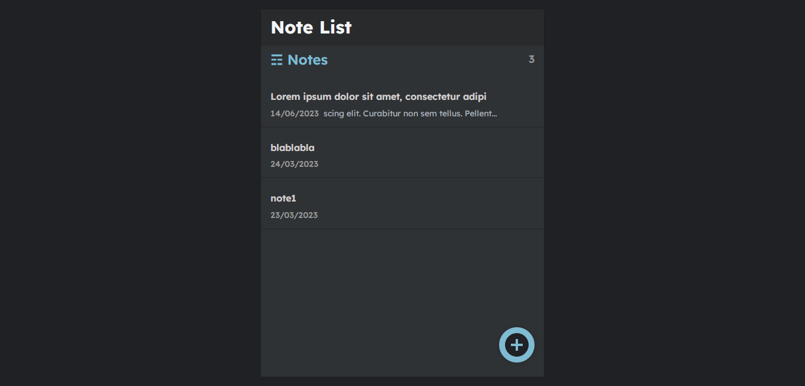
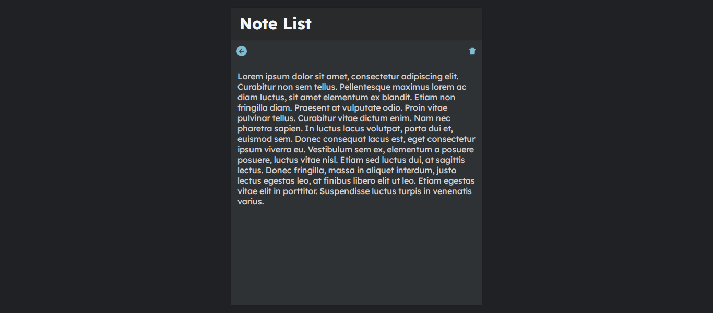
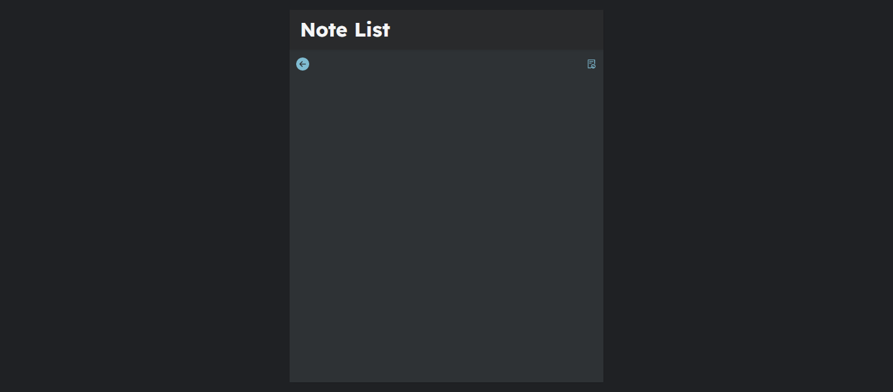

# my-notes-project

# Description
This is a web application project that allows users to create, read, update, and delete notes. The project is built using React.js for the frontend and Django for the backend.

## Features
Create Note: create new notes by providing a title and content for the note. The notes are stored in the backend database.

Read Note: view all the notes they have created. Each note displays the title, content.

Update Note: edit the title and content of their existing notes. The updated information is saved to the backend database.

Delete Note: delete any note they have created. Once a note is deleted, it is permanently removed from the database.

## Screenshots

## Technologies Used

## Contributions

Contributions are welcome! If you have any ideas or suggestions, feel free to open an issue or submit a pull request.

## Contact Information

For any questions or feedback, please contact [kamel touati](mailto:kameltouati19.work@gmail.com).